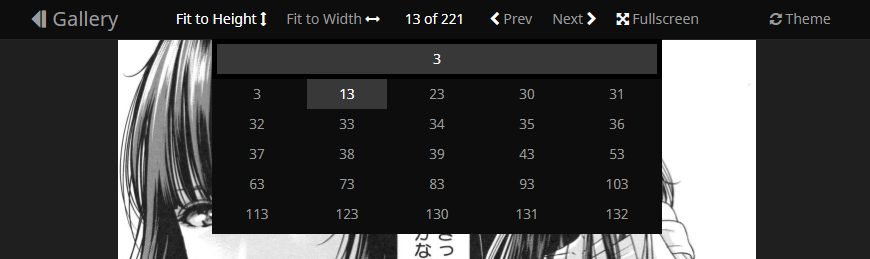

# Nhentai Custom Reader

Written in vanilla js for Tampermonkey/Chrome, not tested in other browsers.

### Features

- custom layout;
- minimized and improved UI;
- adjusted navigation/controls.

Combine all controls in top navbar, add new functions, hotkeys, bind navigation to 4th/5th (browser back and forward) mouse buttons, hide scrollbar, hide cursor on mouseover image, autoscroll page when mouse near bottom/top of image.

## Navigation bar controls and shortcuts

- "Gallery" - return to gallery main page;
- "Prev" - previous page; Keybord shortcut - 'A', 'Left Arrow'; Mouse shortcut - 4th mouse button (browser back); (\*)
- "Next" - next page; Keybord - 'D', 'Right Arrow'; Mouse - 5th buton (browser forward); (\*)
- **(Reworked)** Pagination - open dropdown menu with scrollable pagelist and input field, input filters list as you type in, click on page number to jump or type page number and press 'Enter'; pressing 'ESC' clears input field;
- **(New)** "Fit height", "Fit width", "Fit none" - change image scaling; Keyboard - 'H' - temporary switch untill reload or page closed, global setting inside script;
- **(New)** "Fullscreen" - toggle fullscreen mode; Keyboard - 'F';
- **(New)** "Theme" - change color theme (light, blue and black as defaut site themes); Keyboard - 'T' - also temporary, global setting inside script.

### Notes

(\*) If you plan on using mouse navigation, open reader in new tab because these buttons still will tigger browser back/forward; so far i haven't found any decent way to prevent this.
